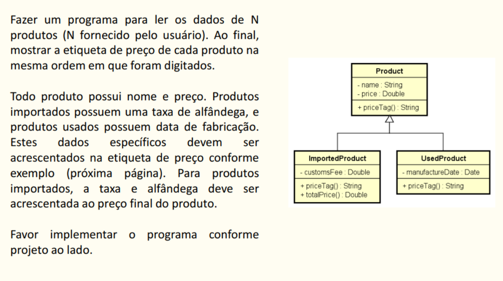
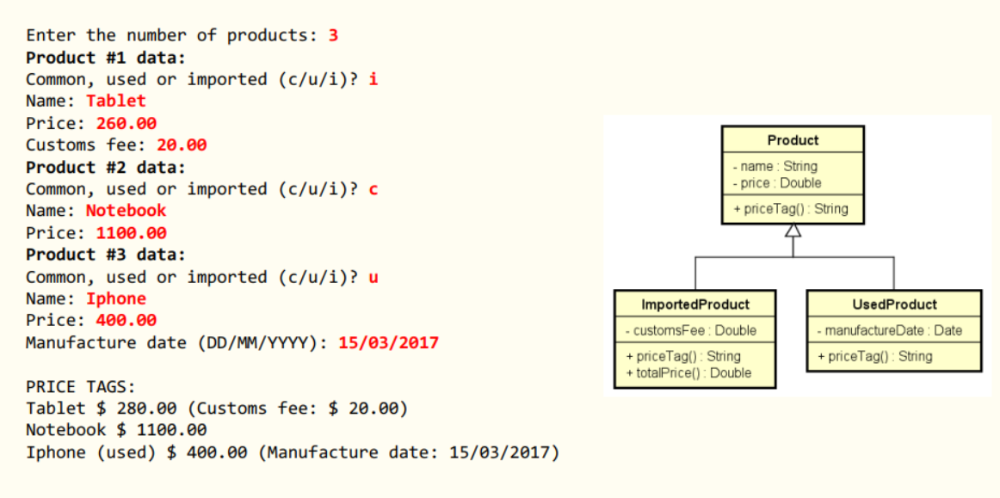

# Exercício 1 

## Saída Esperada

### Observações
As instanciações da superclasse Employee e da subclasse OutSourcedEmployee fora feitos dentro do laço for e dentro dos if, por que? 

* Se o objeto (Employee employee = new Employee(); por exemplo) for declarado fora do laço, ele será reutilizado em cada iteração, o que pode causar problemas na hora de armazenar os objetos em uma lista. Por que armazenar os osbjetos em uma lista? Porque é necessário seguir o modelo de saída desejado do exercício, no caso pede-se que sejam exibidos os PAYMENTS em uma lista da forma como está na imagem em anexo, tnão para isso pensei em criar uma lista para exibi-la no final em um print;

* Mantém o escopo limpo, ou seja, declarar dentro do laço for garante que cada objeto só exista durante aquela iteração, evitando confusão e uso indevido fora do contexto;

* **Por fim, o motivo principal: para inserir os valores corretamente na lista e exibir o print como foi pedido.** 
___

Observe que foi criada uma lista do tipo da superclasse, mas os objetos instanciados dentro dos if dentro do laço for são do tipo das subclasses... a pergunta é "Isso dá algum problema? Pois a lista é de um tipo (superclasse) e os objetos adicionados a ela são de outro, no caso subclasses. Então não seria necessário fazer upcasting?". E a resposta é **"Nesse caso não precisa fazer upcasting!"**, pois o **upcasting nesse caso é feito automaticamente"**. Além disso, no caso, precisamos utilizar métodos específicos de cada subclasse, então não convém fazer upcasting, pois se fizer o upcasting não dá para utilizar os métodos particulares de cada subclasse. Sendo assim, o upcasting é mais indicado quando for tratar dos objetos de forma mais genérica com métodos e atributos somente da superclasse.

___
___

# Exercício 2 

