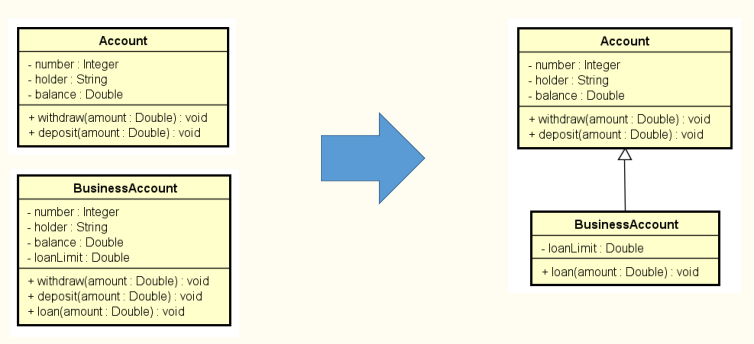

# Herança 

* É um tipo de associação que permite que uma class eher dados e comportamentos de outra classe;

* Permite o reuso de atributos e métodos (dados e comportamentos);

Por exemplo, na imagem a seguir a classe BusinessAccount (subclasse/classe derivada) herda os atributos e métodos da classe Account (superclasse/classe base).

